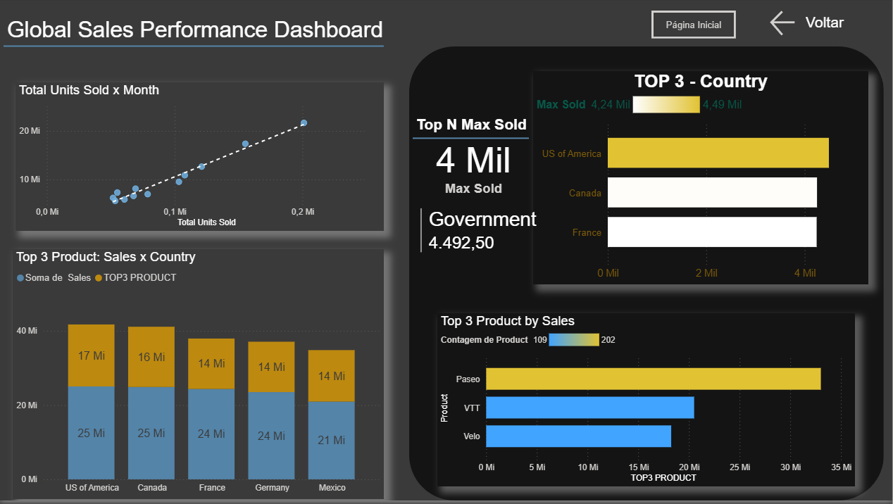
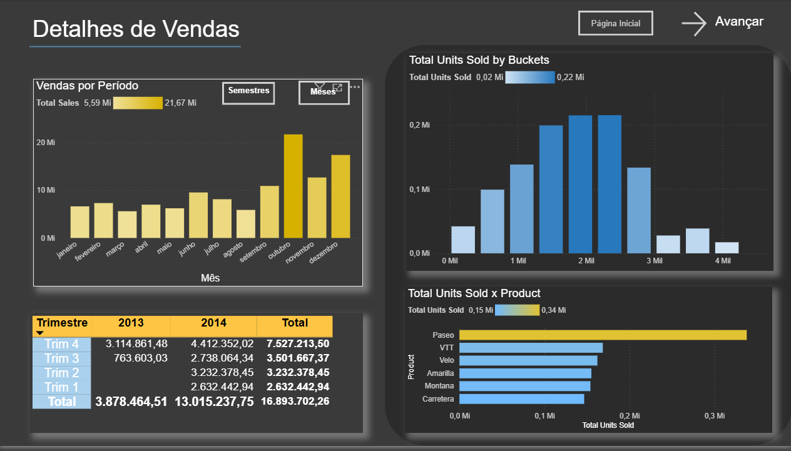

# Projeto: Global Sales Performance (UX/UI Redesign)

Este projeto apresenta a reestilização completa do relatório financeiro baseado na *Financial Sample*, desenvolvido como parte do desafio de "Atualização de Relatório com Foco na Experiência do Usuário (UX)" da DIO.

O objetivo principal não foi apenas apresentar números, mas criar uma interface visualmente agradável, com alto contraste e navegação intuitiva, simulando a experiência de um aplicativo moderno.

## 🎨 Conceitos de Design & UX Aplicados

Para atender aos requisitos de posicionamento, contraste e segmentação, foram adotadas as seguintes estratégias visuais:

* **Dark Mode & Alto Contraste:** Utilização de um fundo escuro (Cinza Chumbo) com elementos em **Amarelo Ouro** e **Azul Claro**. Essa combinação garante que os dados principais saltem aos olhos do usuário, melhorando a legibilidade.
* **Segmentação por Containers:** Uso de formas com bordas arredondadas e sombreamento (efeito de profundidade) para agrupar visualmente as análises de "Top Ranking", separando-as do fluxo geral da página.
* **Hierarquia Visual:** O layout foi organizado para guiar o olhar:
    * Esquerda: Visão temporal e tendências.
    * Direita (Destaque): Foco em rankings (Top 3) e categorias específicas.

## 📱 Funcionalidades de Navegação

O relatório abandona as abas padrões do Power BI em favor de uma navegação interna personalizada:

* **Botões de Ação:** Botões claros de "Página Inicial", "Voltar" e "Avançar" posicionados estrategicamente no cabeçalho.
* **Interatividade de Granularidade:** Na página de detalhes, foram criados botões interativos ("Semestres" | "Meses") que permitem ao usuário alterar a visualização do gráfico de tempo sem sair da tela, utilizando *Bookmarks* (Indicadores).

---

## 📊 Detalhes das Páginas

### 1. Global Sales Performance Dashboard (Visão Geral)
Focada em responder "Quem são os melhores?".
* **Visualizações:**
    * Scatter Plot com linha de tendência para relacionar Unidades Vendidas x Mês.
    * Cartões de KPI destacando o valor máximo vendido.
    * Gráficos de barra focados exclusivamente no **TOP 3** (Países e Produtos), facilitando a tomada de decisão rápida.

### 2. Detalhes de Vendas (Visão Granular)
Focada na análise temporal e distribuição.
* **Visualizações:**
    * Gráfico de colunas principal com alternância de granularidade (Mês/Semestre).
    * Histograma ("Buckets") para analisar a frequência de faixas de vendas.
    * Matriz comparativa de vendas trimestrais (Ano x Ano).

---

## 🛠️ Tecnologias e Técnicas
* **Power BI Desktop:** Ferramenta principal.
* **Design de Interface:** Criação de backgrounds e containers para aplicar o conceito de segmentação visual e profundidade.

